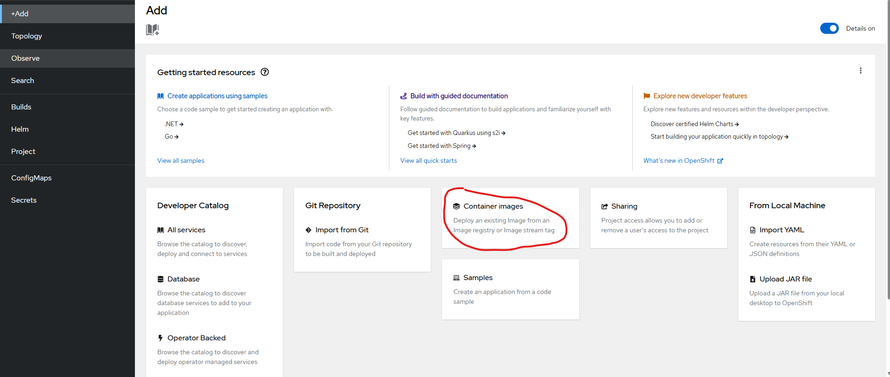
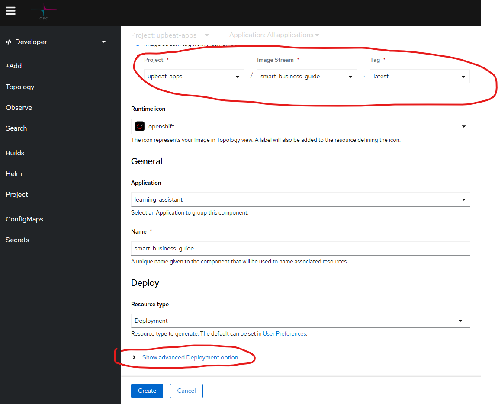
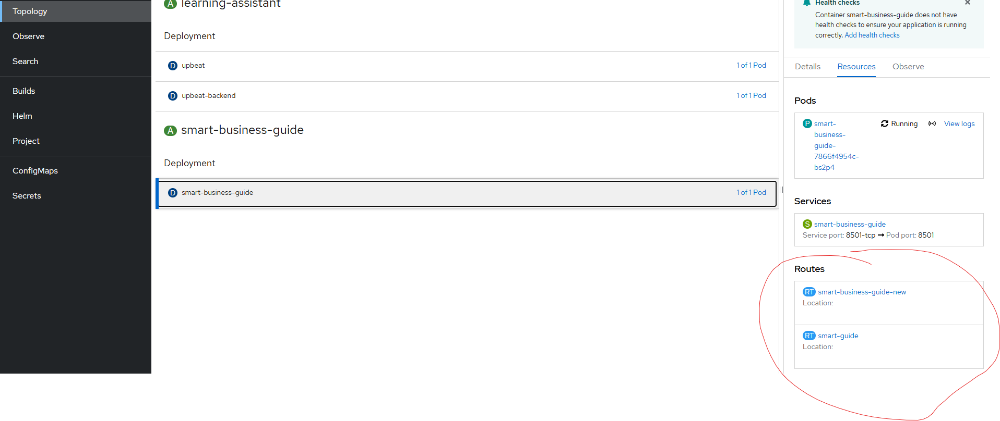

# Deploying to CSC Rahti 2 - Simple Guide

This guide helps you deploy your Smart Business Guide (or any Streamlit application) to CSC Rahti 2, which is CSC's container cloud platform.

## What You'll Need

- A CSC account with access to Rahti
- Your application code (ready to run)
- API keys and other environment variables your app needs

## Step 1: Prepare Your Files

Your application needs these key files:

1. **Dockerfile**: Tells Rahti how to build your application container
2. **entrypoint.sh**: Sets up environment variables and starts your app
3. **.dockerignore**: Keeps your container small by excluding unnecessary files

You can use the existing Dockerfile in this project, which includes optimizations for faster builds. A simpler version would also work fine.

The **entrypoint.sh** script is primarily needed to convert environment variables into Streamlit's required configuration format:

- Streamlit specifically needs a `secrets.toml` file for accessing environment variables
- The script creates this file from the container's environment variables at runtime
- It then starts your Streamlit application correctly in the Linux environment

### About Docker Files

Normally, a Python Dockerfile can be very simple, like this:

```dockerfile
FROM python:3.11-slim
WORKDIR /app
COPY requirements.txt .
RUN pip install -r requirements.txt
COPY . .
CMD ["python", "app.py"]
```

However, for Streamlit applications in Rahti, we need some special setup:

1. The **entrypoint.sh** script is needed because Streamlit requires configuration in a specific format
2. Our Dockerfile uses multi-stage builds to reduce the image size
3. We add special permissions and directories for Streamlit's configuration

You don't need to understand all the details - the provided Dockerfile works for both local testing and Rahti deployment.

## Step 2: Test Locally

Before deploying to Rahti, test your application on your computer:

```bash
# Build your container
docker build -t smart-business-guide:latest .

# Run it with your environment variables from your .env file
# This .env file should contain all the environment variables your app needs (API keys, etc.)
docker run -p 8501:8501 --env-file .env smart-business-guide:latest
```

Visit <http://localhost:8501> to check if your app works correctly.

> **Note:** If you're confident that your application is configured correctly, you can skip the testing step and proceed directly to deployment.

If you see an error like `exec ./entrypoint.sh: no such file or directory`, it's likely due to Windows line endings. Fix it with:

```bash
# Convert to Unix line endings (install dos2unix if needed)
dos2unix entrypoint.sh
```

## Step 2.5: Ensure Rahti 2 Access and Create Project

Before uploading to Rahti, you need to:

1. **Ensure you have Rahti 2 access**:

   - Request access through the MyCSC portal if you don't already have it
   - Follow the instructions at: <https://docs.csc.fi/cloud/rahti/access/>

2. **Create a Rahti 2 project**:
   - Log in to the Rahti 2 web console
   - Create a new project following the guide at: <https://docs.csc.fi/cloud/rahti/usage/projects_and_quota/#creating-a-project>
   - Note your project name as you'll need it in the next steps

## Step 3: Upload to Rahti

1. Log in to Rahti:

   - Go to <https://console.rahti.csc.fi/>
   - Click your username (right top corner of screen) and select "Copy login command"
   - Run the command in your terminal

2. Push your image to Rahti's registry:

   ```bash
   # Log in to the registry
   docker login -u unused -p $(oc whoami -t) image-registry.apps.2.rahti.csc.fi

   # Tag your image with your project name
   docker tag smart-business-guide:latest image-registry.apps.2.rahti.csc.fi/your-project-name/smart-business-guide:latest

   # NOTE: Replace "your-project-name" with the actual name of your Rahti 2 project that you created in Step 2.5

   # Push the image
   docker push image-registry.apps.2.rahti.csc.fi/your-project-name/smart-business-guide:latest
   ```

   > **Note:** When you push an image to Rahti, it automatically creates an image registry entry in Rahti's internal registry, similar to GitHub but for Docker images. You can also use external registries like Docker Hub if preferred.

## Step 4: Deploy in Rahti

1. In the Rahti web console, select your project
2. Click "+Add" > "Container images"
3. Enter your image name (Image stream tag from internal registry): `PROJECT/IMAGE-STREAM/TAG`
4. Name your application (e.g., "smart-business-guide")
5. Show advanced Deployment options
6. Add your environment variables:
   - `TAVILY_API_KEY`
   - `GROQ_API_KEY`
   - `OPENAI_API_KEY`
7. Click "Create"

## Step 5: Access Your App

1. Wait for deployment to complete
2. Click the application URL shown in the Rahti dashboard
3. Your app should now be running in Rahti!

## Making Updates

To update your application:

1. Make your code changes
2. Build a new image with a new version tag
3. Push it to the Rahti registry
4. Update your deployment to use the new version

For more information:

- [CSC's Rahti documentation](https://docs.csc.fi/cloud/rahti/rahti-what-is/)
- [Using Rahti Integrated Registry](https://docs.csc.fi/cloud/rahti/images/Using_Rahti_integrated_registry/)

## Quick Docker Reference

If you're new to Docker, here's a quick tutorial that explains the core concepts in just 100 seconds:

- [Docker Tutorial in 100 Seconds](https://www.youtube.com/watch?v=Gjnup-PuquQ)

## Screenshots

Below are some screenshots showing the Rahti deployment process:

### Rahti Add



### Settings



### Route (URL for app)


